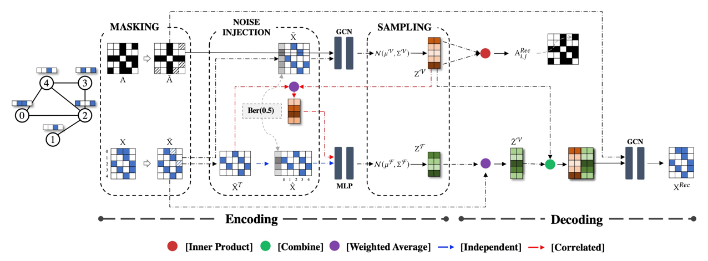

# SeeGera
This is the official repository of paper **Self-supervised Semi-implicit Graph Variational Auto-encoders
with Masking**.

## Dependencies
- torch 1.10.2
- dgl 0.9.0
- networkx 2.5.1
- sklearn 0.24.2
- scipy 1.5.4
- numpy 1.19.5
- pyyaml 6.0

Install all dependencies using
```
pip install -r requirements.txt
```

## Quick Start
For quick start, you could run the scripts to reproduce the reported results.

#### Link Prediction
```bash
python run.py --use-cfg --tag cora_independent_link
python run.py --use-cfg --tag cora_correlated_link
python run.py --use-cfg --tag cora_correlated_masking_link
```

#### Attr Inference
```bash
python run.py --use-cfg --tag cora_independent_attr
python run.py --use-cfg --tag cora_correlated_attr
python run.py --use-cfg --tag cora_correlated_masking_attr
```

#### Node Classification
```bash
python run.py --use-cfg --tag cora_independent_node
python run.py --use-cfg --tag cora_correlated_node
python run.py --use-cfg --tag cora_correlated_masking_node
```
## Arguments
```
--version               str         Method version.                 Default is 'independent', supports ['independent', 'correlated'].
--dataset               str         Dataset.                        Default is 'cora', supports ['cora', 'citeseer', 'pubmed', 'photo', 'comp', 'cs', 'physics'].
--link-prediction       boolean     Do link prediction.             Default is False.
--attr-inference        boolean     Do attr inference.              Default is False.
--node-classification   boolean     Do node classification.         Default is False.
--encoder-type          str         Encoder type.                   Default is 'gcn'.
--encoder-layers        int         Encoder layers.                 Default is 2.
--decoder-type          str         Decoder type.                   Default is 'gcn'.
--decoder-layers        int         Decoder layers.                 Default is 2.
--gpu-id                int         GPU index.                      Default is 0.
--seeds                 list        Randoms seeds.                  Default is [0, 1, 2, 3, 4, 5, 6, 7, 8, 9].
--pretrain-epochs       int         Pretraining epochs.             Default is 3500.
--pretrain-lr           float       Pretraining learning rate.      Default is 0.001.
--pretrain-wd           float       Weight decay of pretraining.    Default is 0.
--pretrain-dropout      float       Dropout of pretraining.         Default is 0.
--finetune-interval     int         Interval between finetuneings.  Default is 10.
--finetune-epochs       int         Finetuning epochs.              Default is 500.
--finetune-lr           float       Finetune learning rate.         Default is 0.01.
--finetune-wd           float       Weight decay of finetuning.     Default is 0.
--finetune-dropout      float       Dropout of finetuning.          Default is 0.
--node-loss-type        str         Loss type@node reconstruction.  Default is 'bce'.
--attr-loss-type        str         Loss type@attr inference.       Default is 'bce'.
--aug-e                 float       Structure masking ratio.        Default is 0.
--aug-a                 float       Feature masking ratio.          Default is 0.
--use-cfg               boolean     Use the best config.            Default is False.                 
```